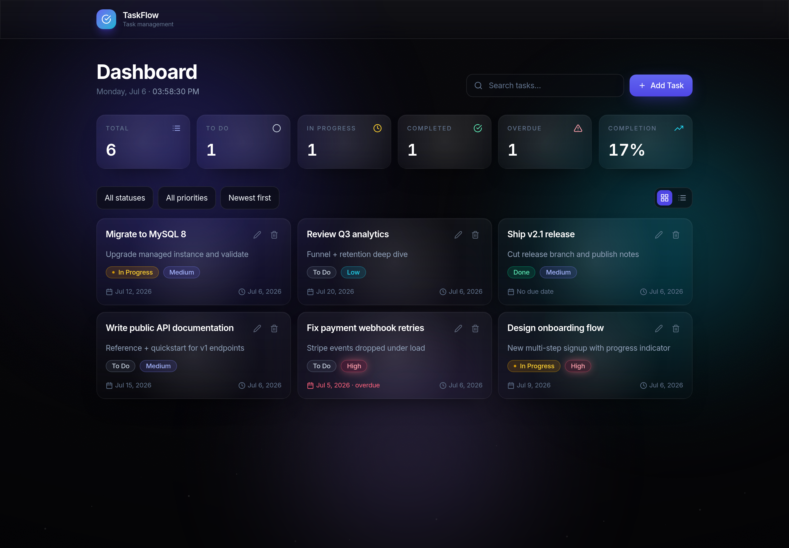
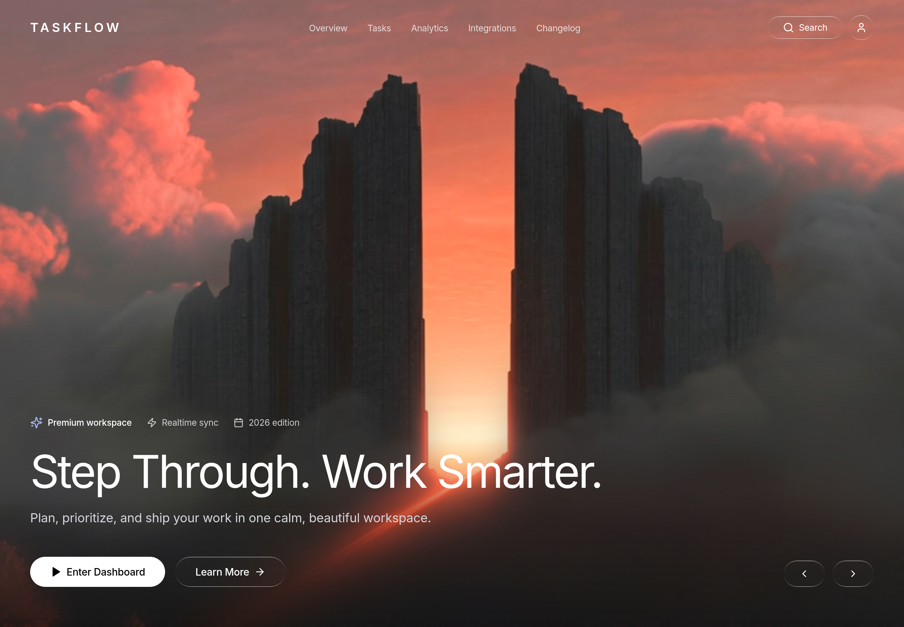

# TaskFlow — Full-Stack Task Manager

A production-quality **CRUD task manager** built with **React + Django REST Framework + MySQL**.
It offers a premium, dark-glassmorphism dashboard for creating, tracking, filtering, and
completing tasks.

> **Author:** Akshaya Puvvala
> **Stack:** React 19 · TypeScript · Tailwind CSS v4 · Framer Motion · Django 6 · DRF · MySQL



---

## Overview

TaskFlow is a single-page dashboard backed by a REST API. Users can create tasks with a title,
description, status, priority, and due date, then search, filter, sort, edit, and delete them.
A statistics strip summarises progress (totals per status, overdue count, and completion rate).

The project is split into two independently deployable apps:

- **`backend/`** — Django + Django REST Framework API, MySQL database.
- **`frontend/`** — React 19 + Vite + TypeScript single-page app.

---

## Features

- **Full CRUD** — create, read, update (PUT/PATCH), and delete tasks.
- **Rich task model** — title, description, status (To Do / In Progress / Done), priority
  (Low / Medium / High), due date, created/updated timestamps.
- **Statistics** — totals per status, overdue detection, and completion rate.
- **Search, filter & sort** — debounced text search, status/priority filters, multiple orderings.
- **Two responsive layouts** — data table on desktop, cards on mobile, with a view toggle.
- **Polished UX** — animated modals, toast notifications, optimistic delete, loading skeletons,
  empty and error states, form validation with server-error mapping.
- **Accessible** — focus trap + restore in modals, ARIA labels, keyboard support (Esc / Tab),
  and honours `prefers-reduced-motion`.

---

## Tech stack

| Layer     | Technologies |
|-----------|--------------|
| Frontend  | React 19, TypeScript, Vite, Tailwind CSS v4, Framer Motion, Axios, React Icons |
| Backend   | Python, Django 6, Django REST Framework, Gunicorn, WhiteNoise |
| Database  | MySQL 8 (MariaDB-compatible), via PyMySQL |
| Tooling   | oxlint, Playwright (dev-time E2E), python-dotenv |

---

## Folder structure

```
task-crud/
├── backend/
│   ├── core/                 # Django project (settings, urls, wsgi/asgi)
│   ├── tasks/                # App: models, serializers, services, views, urls, admin, tests
│   ├── manage.py
│   ├── requirements.txt
│   └── .env.example
├── frontend/
│   ├── src/
│   │   ├── api/              # Axios client + typed task endpoints
│   │   ├── animations/       # Framer Motion variants
│   │   ├── components/
│   │   │   ├── ui/           # Reusable primitives (Button, Card, Modal, Badge, Toast, …)
│   │   │   ├── dashboard/    # Header, stat cards
│   │   │   └── tasks/        # Task card, table, form modal, filters, states
│   │   ├── hooks/            # useTasks, useDebounce
│   │   ├── layouts/          # AppLayout
│   │   ├── pages/            # DashboardPage
│   │   ├── types/            # Task domain types (API contract)
│   │   └── utils/            # cn, date formatting, task metadata, API error parsing
│   ├── package.json
│   └── .env.example
├── docs/
│   └── screenshot.png
└── README.md
```

---

## Screenshots

| Landing hero | Dashboard |
|--------------|-----------|
|  |  |

_(Add more screenshots — e.g. the create/edit modal and mobile card view — under `docs/`.)_

The app opens on a cinematic landing hero; **Enter Dashboard** transitions into the workspace.

---

## Getting started (local)

### Prerequisites

- **Node.js** ≥ 20
- **Python** ≥ 3.12
- **MySQL 8** or **MariaDB** running locally
- **Git**

### 1. Clone

```bash
git clone https://github.com/dhruthipuvvala-cmyk/task-crud.git
cd task-crud
```

### 2. Backend setup

```bash
cd backend
python -m venv venv
source venv/bin/activate            # Windows: venv\Scripts\activate
pip install -r requirements.txt
cp .env.example .env                 # then edit .env with your DB credentials
```

Create the local database and a user (MySQL / MariaDB shell):

```sql
CREATE DATABASE taskflow CHARACTER SET utf8mb4 COLLATE utf8mb4_unicode_ci;
CREATE USER 'taskflow'@'localhost' IDENTIFIED BY 'your-password';
GRANT ALL PRIVILEGES ON taskflow.* TO 'taskflow'@'localhost';
FLUSH PRIVILEGES;
```

Apply migrations and (optionally) create an admin user:

```bash
python manage.py migrate
python manage.py createsuperuser   # optional, for /admin/
```

### 3. Frontend setup

```bash
cd ../frontend
npm install
cp .env.example .env                 # VITE_API_URL defaults to the local backend
```

---

## Running locally

Run the two servers in separate terminals:

```bash
# Terminal 1 — backend (http://127.0.0.1:8000)
cd backend && source venv/bin/activate && python manage.py runserver

# Terminal 2 — frontend (http://localhost:5173)
cd frontend && npm run dev
```

Open **http://localhost:5173**.

---

## Environment variables

### Backend (`backend/.env`)

| Variable               | Required | Description |
|------------------------|----------|-------------|
| `SECRET_KEY`           | yes (prod) | Django secret key. |
| `DEBUG`                | no       | `True` for development, `False` in production. |
| `ALLOWED_HOSTS`        | yes (prod) | Comma-separated hostnames (e.g. `your-api.onrender.com`). |
| `CORS_ALLOWED_ORIGINS` | yes      | Comma-separated frontend origins (e.g. `https://your-app.vercel.app`). |
| `CSRF_TRUSTED_ORIGINS` | prod     | Comma-separated trusted origins. |
| `DB_NAME`              | yes      | MySQL database name. |
| `DB_USER`              | yes      | MySQL user. |
| `DB_PASSWORD`          | yes      | MySQL password. |
| `DB_HOST`              | yes      | MySQL host. |
| `DB_PORT`              | yes      | MySQL port (default `3306`). |
| `DB_SSL_MODE`          | prod     | Set to `require` for managed hosts (e.g. Aiven) that enforce TLS. |

### Frontend (`frontend/.env`)

| Variable       | Required | Description |
|----------------|----------|-------------|
| `VITE_API_URL` | yes      | Base URL of the API **including** the `/api/` prefix and trailing slash. |

Only `*.env.example` files are committed — never commit a real `.env`.

---

## Running tests

```bash
cd backend
source venv/bin/activate
python manage.py test        # DRF API tests (CRUD, validation, filtering, stats)
```

The frontend was verified end-to-end with a headless-Chromium (Playwright) flow covering
create / read / update / delete / search / filter / sort / validation.

---

## Build commands

```bash
# Frontend production build (type-check + bundle)
cd frontend && npm run build     # output in frontend/dist/

# Frontend lint
npm run lint

# Backend static files (production)
cd backend && python manage.py collectstatic --noinput
```

---

## Deployment

TaskFlow deploys as three pieces — a database cannot live on Vercel, so it needs a dedicated host.

```
React (Vercel) ──▶ Django API (Render) ──▶ MySQL (managed host, e.g. Aiven)
```

### Database (managed MySQL)

Provision a MySQL instance (e.g. **Aiven** free tier) and note the host, port, database, user,
and password. Managed hosts usually enforce TLS — set `DB_SSL_MODE=require`.

### Backend → Render

1. New **Web Service** from the GitHub repo, **Root Directory** `backend`.
2. **Build Command:** `pip install -r requirements.txt && python manage.py collectstatic --noinput`
3. **Start Command:** `gunicorn core.wsgi:application`
4. Add the backend environment variables above (`SECRET_KEY`, `DEBUG=False`,
   `ALLOWED_HOSTS`, `CORS_ALLOWED_ORIGINS`, all `DB_*`, `DB_SSL_MODE=require`).
5. After the first deploy, run `python manage.py migrate` from the Render shell.

> `collectstatic` in the build step is required: production uses WhiteNoise with
> `CompressedManifestStaticFilesStorage`, so the static manifest must be generated at build
> time or `/admin/` and the browsable API would error with `DEBUG=False`.

### Frontend → Vercel

1. Import the repo, **Root Directory** `frontend` (framework auto-detected as Vite).
2. Set `VITE_API_URL=https://<your-backend>.onrender.com/api/`.
3. Deploy.

> `PyMySQL` and `cryptography` are already in `requirements.txt` — the latter is required for
> MySQL 8's `caching_sha2_password` authentication.

---

## API overview

Base URL: `/api/`

| Method | Endpoint            | Description |
|--------|---------------------|-------------|
| GET    | `/api/health/`      | Liveness probe. |
| GET    | `/api/tasks/`       | List tasks (paginated). Supports `?search=`, `?status=`, `?priority=`, `?ordering=`. |
| POST   | `/api/tasks/`       | Create a task. |
| GET    | `/api/tasks/{id}/`  | Retrieve a task. |
| PUT    | `/api/tasks/{id}/`  | Full update. |
| PATCH  | `/api/tasks/{id}/`  | Partial update. |
| DELETE | `/api/tasks/{id}/`  | Delete a task. |
| GET    | `/api/tasks/stats/` | Aggregated statistics (respects active filters). |

**Task fields:** `id`, `title`, `description`, `status` (`todo` \| `in_progress` \| `done`),
`priority` (`low` \| `medium` \| `high`), `due_date`, `created_at`, `updated_at`, plus read-only
`status_display` / `priority_display` labels.

---

## Design decisions

- **12-factor configuration.** All secrets and hosts come from environment variables; no
  credentials are hardcoded, and only `.env.example` files are committed.
- **Thin views, dedicated service layer.** Statistics aggregation lives in `tasks/services.py`,
  keeping the ViewSet focused on request handling (single-responsibility).
- **Typed API contract.** `frontend/src/types/task.ts` mirrors the serializer, and the API layer
  (`api/`) is fully separated from UI; components consume data only via the `useTasks` hook.
- **Hand-built UI primitives.** Buttons, cards, modal, badges, toasts, and form controls are
  written in-house rather than pulled from a component kit — no unnecessary dependencies.
- **Tailwind v4 design tokens.** Colors, fonts, and glass utilities are defined once via `@theme`
  / `@utility` for consistent spacing, typography, and color.
- **Optimistic delete** with rollback for snappy interactions, and DRF error responses are mapped
  back onto individual form fields.

---

## Future improvements

- User authentication & per-user task ownership.
- Server-side pagination controls in the UI (the API is already paginated).
- Drag-and-drop board view (Kanban) across status columns.
- Automated frontend unit/component tests and a CI pipeline.
- Bulk actions, tags/labels, and recurring tasks.
- Light-theme toggle.

---

## License

This project was created for educational purposes.
